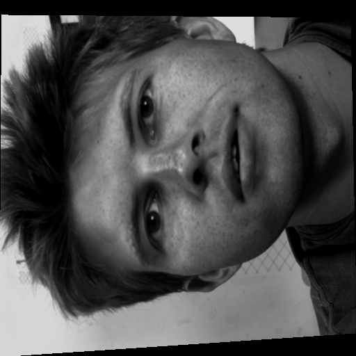
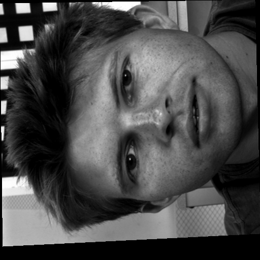

# Graph Cuts Disparity Estimation

This project estimates stereo disparity with a graph cuts approach and turns the result into a depth-based 3D mesh. The main implementation is in [GCDisparity.cpp](GCDisparity.cpp), with a small graph-cut example in [exampleGC.cpp](exampleGC.cpp).

It is aimed at teachers, recruiters, and readers in the AI and computer vision community who want to see a compact but complete stereo pipeline. The code loads a rectified image pair, builds a graph over candidate disparities, computes a minimum cut, decodes the disparity map, smooths it, and can display a 3D mesh when OpenGL support is available.

## Interesting techniques

- Patch-based stereo matching with normalized cross-correlation (ZNCC).
- Graph construction over a 3D state space made of pixel coordinates and disparity levels.
- Source/sink terminal weights and n-links to encode data and smoothness terms.
- A discrete energy formulation with integer weights for max-flow/min-cut.
- Downsampling with a zoom factor to keep the graph smaller and faster to compute.
- Disparity decoding from the cut boundary rather than from direct optimization output.
- Optional disparity blur before the 3D view to reduce noise.
- 3D mesh generation from the disparity map for visual inspection.

## Workflow

1. **Load rectified images** — Read a stereo image pair that has already been rectified (epipolar lines aligned horizontally).
2. **Compute patch matching** — For each pixel in image 1, compute normalized cross-correlation (ZNCC) scores with candidate pixels in image 2 across a range of disparities.
3. **Build graph** — Construct a 3D graph where each node encodes a pixel location and a disparity hypothesis. Source/sink terminal edges encode matching costs; inter-node edges encode smoothness penalties.
4. **Compute minimum cut** — Run the max-flow algorithm to find the cut that minimizes total energy, which gives the best disparity labeling.
5. **Decode disparity map** — Extract disparity values by examining the cut boundary for each pixel.
6. **Smooth disparity** — Apply Gaussian blur to reduce noise in the disparity map.
7. **Generate 3D mesh** — Convert disparity to depth using the camera focal length and baseline, then create a triangulated surface mesh for visualization.

## Notable external libraries and technologies

- [Imagine++](https://imagine.enpc.fr/~monasse/Imagine++/)
	- Used for image loading, display windows, OpenGL-based mesh rendering, and utility image operations.
- [Boykov-Kolmogorov max-flow / min-cut library](maxflow/)
	- The bundled `maxflow` implementation provides the graph-cut solver used by the disparity estimator.
    - [Check Original Implementation Library]( http://pub.ist.ac.at/~vnk/software.html)
- OpenGL support through Imagine++
	- Enables the interactive 3D mesh preview when the library is built with OpenGL support.

No project-specific font is defined in the code. The visual output comes from image display and mesh rendering, not custom typography.

## Project structure

```tree
Lab 4: Graphs Cuts for diparity estimation/
├── GCDisparity.cpp
├── exampleGC.cpp
├── CMakeLists.txt
├── assets/
├── results/
└── maxflow/
```

- __[assets/](assets/)__ contains the stereo input images used by the exercises and demo runs.
- __[results/](results/)__ contains some stereo output results.
- __[maxflow/](maxflow/)__ contains the bundled graph-cut solver implementation and its headers.
- __[GCDisparity.cpp](GCDisparity.cpp)__ is the main stereo disparity application.
- __[exampleGC.cpp](exampleGC.cpp)__ is a compact demo that shows how the graph-cut library works on a small sample graph.

## Hyperparameters Considered for the prototype : 

- __Recommended image size__ : 512x512
- __clipping (cropping) margin__ : 20 to 30 pixels
- __NCC neighborhood size__ : 3 pixel radius, i.e. 7x7 pixel patch
- __disparity range__ (not to over-dimension the graph): dmin = 10, dmax=55
- __Discretization factor to weight the penalty of non-correlating pixels__ : wcc = 20
- __Penalty for pairwise potentials__ : λ/wcc = 0.1, i.e., λ = 0.1 * wcc,

**Remark** : As we build a graph with int weights, the penalty must be ≥ 1.

## Examples : 

Here are the first two images to try with this method : 

 

3D Reconstruction meshes look like while varying the __regularization term__ coefficient $\lambda$ : 

<p align="center">
<strong>λ = 0.1</strong><br>

<br><br>
<strong>λ = 0.5</strong><br>

<br><br>
<strong>λ = 0.0</strong><br>

</p>

**Key Takeaway** : 
- Increasing $\lambda$ gives stronger smoothness.
- Decreasing lambda gives Weaker regularization. As a result, we get sharper details, more accurate discontinuities.
